# 🚀 Ruslan AWS — CI/CD Pipeline for Application Deployment


---

## 🌐 Live Demo

🔹 **Wait Page:** [https://app.ci-wake.online](https://app.ci-wake.online)  
When you click **“Wake Up”**, the EC2 instance powers on automatically and the site becomes available.  
After **5 minutes of inactivity**, it shuts down to save cost — all managed automatically by Lambda and CloudWatch.

---

## 🧠 Project Overview

This project is a **fully automated infrastructure pipeline** for deploying and managing a web application on AWS using:
- **Terraform** — full Infrastructure as Code  
- **GitHub Actions (OIDC)** — CI/CD automation  
- **Serverless control plane** — Lambda functions for wake/sleep logic  
- **Auto-wake page** — hosted on S3 + CloudFront with custom domain  
- **Monitoring and alerts** — via CloudWatch and SNS  

It demonstrates how to build a **production-grade CI/CD environment** that stays cost-efficient while showcasing real AWS automation.

---

## ⚙️ Architecture

```mermaid
flowchart TD
  subgraph CF["CloudFront + S3 — Wait Site"]
    U["User / Browser"] -->|Wake Up| W["Wait Page: app.ci-wake.online"]
  end

  W -->|POST /wake| API["API Gateway HTTP"]
  W -->|GET /status| API

  API --> Lwake["Lambda: wake"]
  API --> Lstatus["Lambda: status"]

  Lwake --> EC2["EC2: Amazon Linux 2023"]
  Lstatus --> EC2

  subgraph CW["CloudWatch"]
    Reaper["Lambda: reaper (EventBridge 1m)"] --> EC2
    EC2 --> Dash["Dashboards & Alarms"]
    Dash --> SNS["SNS Email"]
  end

  style CF fill:#0e1117,stroke:#00bfff,stroke-width:2px
  style CW fill:#1e2230,stroke:#ff9800,stroke-width:2px
  style API fill:#18202d,stroke:#66ccff,stroke-width:1.5px
  style EC2 fill:#f07b05,stroke:#ffffff,stroke-width:2px
  style Lwake fill:#00a67c,stroke:#ffffff
  style Lstatus fill:#0077cc,stroke:#ffffff
  style Reaper fill:#e91e63,stroke:#ffffff
```



---

## 🧩 Components

### 🌩️ Infrastructure (Terraform)
- **S3 backend + DynamoDB** — for Terraform state locking  
- **EC2 instance** — Amazon Linux 2023 with Apache + auto-deploy site.zip  
- **IAM roles** — CloudWatch Agent & Lambda policies  
- **Lambda functions**
  - `wake`: starts the EC2 instance
  - `status`: checks EC2 state and public IP
  - `reaper`: auto-stops instance after idle period  
- **EventBridge rule** — triggers `reaper` every minute  
- **CloudWatch dashboard** — metrics for CPU, status checks, Lambda invocations  
- **SNS alerts** — email when CPU > 70% or EC2 fails health check  

---

## 🚀 CI/CD Workflow (GitHub Actions)

- **OIDC authentication** (no access keys)
- **Terraform plan/apply/destroy** pipeline  
- Triggered manually or on commit in `infra/**`  
- Uses concurrency groups to prevent race conditions  

---

## 💰 Cost Optimization

| Mechanism | Description |
|------------|--------------|
| 💤 **Auto Sleep** | EC2 automatically stops after 5 minutes of inactivity |
| ⚡ **Wake on Demand** | EC2 starts only when user clicks “Wake Up” |
| ☁️ **S3 + CloudFront** | Wait site is fully static (Always-Free) |
| 🧠 **Serverless Control Plane** | Lambdas only run for milliseconds per event |
| 💾 **State backend** | Terraform state stored in low-cost S3/DynamoDB |

---

## 📊 Monitoring

CloudWatch Dashboard includes:
- **EC2 metrics** — CPU Utilization, Status Checks  
- **Lambda Invocations / Errors** — wake, status, reaper  
- **CWAgent** — memory and disk usage  
- **SNS Alerts** — via email

### 🖥️ View in AWS Console
Go to **CloudWatch → Dashboards → ruslan-aws-dev-overview**

---

## 🧪 Simulate Load (Trigger CloudWatch Alarm)

To trigger the **CPU Utilization > 70%** alert on the EC2 instance, run this inside the EC2 terminal:

```bash
sudo yum install -y stress
stress --cpu 4 --timeout 120
```

Or with Amazon Linux 2023:

```bash
sudo dnf install -y stress-ng
sudo stress-ng --cpu 4 --timeout 120
```

---

## 🧭 Domain & Certificates

| Component | Domain | Certificate ARN |
|------------|---------|----------------|
| 🌐 Wait Site | [app.ci-wake.online](https://app.ci-wake.online) | `arn:aws:acm:us-east-1:097635932419:certificate/0d400c46-2086-41b1-b6c2-74112715701a` |
| ⚙️ API Gateway | api.ci-wake.online | Same ACM (validated via Route53 + Namecheap) |

---

## 🧾 Folder Structure

```
ci-cd-pipeline-aws/
├── app/                    # deployed site files
├── wait-site/              # CloudFront + S3 static wait page
│   ├── index.html
│   └── assets/js/app.js
├── infra/
│   ├── main.tf             # EC2, SG, user_data
│   ├── infra-wake/         # Lambdas wake/status/reaper
│   ├── dashboard.tf        # CloudWatch Dashboards
│   └── sns.tf              # SNS alerts
├── lambdas/
│   ├── wake/index.js
│   ├── status/index.py
│   └── reaper/index.py
├── build/                  # ZIP artifacts for Lambda
├── cloudwatch/             # CloudWatch agent config
└── .github/workflows/terraform.yml
```

---

## 🧠 Key Highlights
- **Zero manual intervention:** Terraform handles all provisioning.  
- **GitHub → AWS via OIDC:** no secrets in the repo.  
- **Real cost control:** EC2 sleeps automatically after idle.  
- **Visual dashboards:** live metrics and timeline of wake/sleep events.  
- **Portfolio-ready:** clean architecture, full automation, real custom domains.
