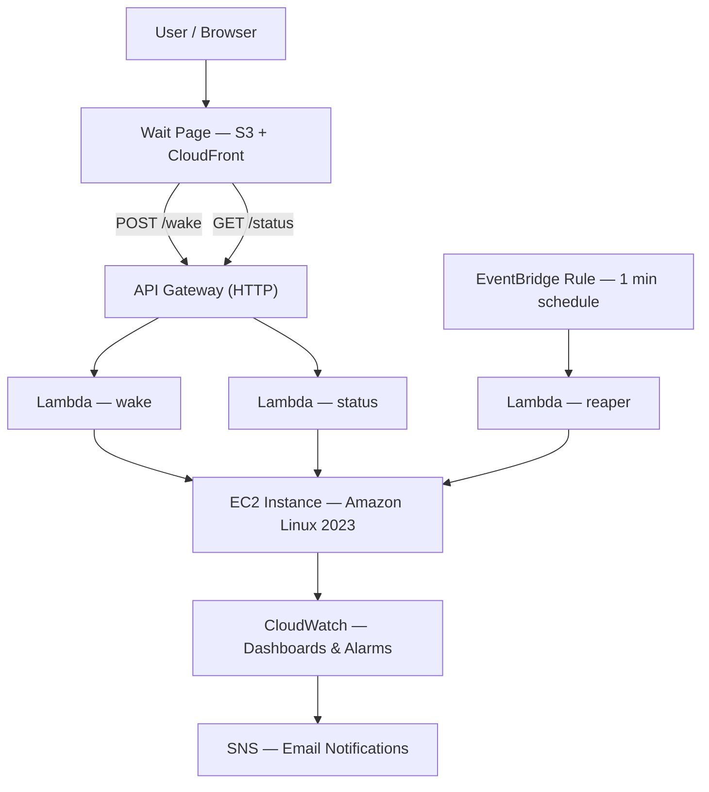

# 🚀 Ruslan AWS — CI/CD Pipeline for Application Deployment

This project demonstrates a **complete, production-ready DevOps and Cloud Engineering workflow** on AWS — built entirely as code, fully automated, and optimized for cost efficiency.

It’s designed to show **how a modern cloud application can wake up, deploy, monitor, and shut down automatically**, all through event-driven serverless architecture and GitHub Actions.

---

## 🧩 Core Idea

The goal is to prove that **a cloud app can run production-grade infrastructure while staying 100% serverless when idle** — paying only for active compute time.  

The system combines:
- **Terraform (IaC)** for provisioning,
- **GitHub Actions (OIDC)** for CI/CD automation,
- **Lambda + EventBridge** for control logic,
- **EC2** for the actual app hosting (on-demand),
- **S3 + CloudFront** for static content,
- **CloudWatch + SNS** for monitoring and alerts.

---

## ⚙️ High-Level Flow

1. **User opens** the static “Wait Page” hosted on S3 + CloudFront:  
   👉 [https://app.ci-wake.online](https://app.ci-wake.online)

2. The user clicks **“Wake Up”**, triggering an **API Gateway (HTTP API)** request.

3. API Gateway invokes **Lambda “wake”**, which:
   - Starts the EC2 instance (Amazon Linux 2023),
   - Waits for the instance to become healthy,
   - Returns its public DNS back to the frontend.

4. The frontend then redirects the browser to the live site running on that EC2 instance.

5. Every minute, **EventBridge** triggers **Lambda “reaper”**, which:
   - Checks the timestamp of last activity stored in **SSM Parameter Store** (`/ci-wake/last_wake`),
   - Automatically stops the EC2 instance if idle longer than 5 minutes.

6. All system metrics, Lambda invocations, and EC2 performance data stream into **CloudWatch Dashboards**, with alarms that:
   - Send **email alerts via SNS** if CPU > 70% or instance becomes unhealthy.

---

## 🏗️ Infrastructure Components

| Layer | Service | Purpose |
|-------|----------|----------|
| **Frontend** | **S3 + CloudFront** | Static “wait” page for users (Always-Free Tier) |
| **Control Plane** | **API Gateway (HTTP)** | Entry point for wake/sleep automation |
|  | **Lambda (wake, status, reaper)** | Serverless logic for EC2 lifecycle management |
|  | **EventBridge Rule (1m)** | Periodic scheduler for `reaper` function |
|  | **SSM Parameter Store** | Stores last wake timestamp |
| **Application Layer** | **EC2 (Amazon Linux 2023)** | Hosts the actual application, started on demand |
| **Observability** | **CloudWatch Dashboards** | EC2 + Lambda metrics, CPU, memory, alarms |
|  | **SNS (Email)** | Sends alerts when alarms trigger |
| **CI/CD** | **GitHub Actions (OIDC)** | Terraform automation without access keys |
| **State Management** | **S3 + DynamoDB** | Backend for Terraform state and locking |

---

## 🔄 CI/CD Workflow

**Terraform Pipelines**
- Two workflows:  
  - `terraform.yml` — provisions the full infrastructure.  
  - `infra-wake.yml` — manages the wake/sleep Lambda environment.

**Secure OIDC Authentication**
- GitHub connects to AWS via a **federated IAM role** (`github-actions-ci-cd-pipeline-aws`), avoiding static credentials.

**Automatic Environment Handling**
- Each push to `main` or manual dispatch triggers Terraform **plan/apply/destroy** jobs.
- Terraform uses **remote state** in S3, ensuring collaboration and safe locking via DynamoDB.

---

## 💰 Cost Optimization Strategy

| Mechanism | Purpose |
|------------|----------|
| 💤 **Auto Sleep** | Lambda `reaper` stops EC2 after 5 minutes of inactivity. |
| ⚡ **Wake on Demand** | Lambda `wake` starts EC2 only when user clicks “Wake Up”. |
| ☁️ **Always-Free Layer** | Wait site hosted on S3 + CloudFront, costing $0. |
| 🧠 **Serverless Control Plane** | Lambdas execute for milliseconds — nearly free. |
| 💾 **IaC State in S3/DynamoDB** | Low-cost, reliable backend for Terraform state. |
| 📊 **Event-Driven Alerts** | SNS triggers only when alarms fire — no idle billing. |

This keeps the infrastructure running **for less than a few cents per day** — ideal for demos, training, or portfolio showcases.

---

## 🧠 What It Demonstrates

- Full **IaC discipline**: every resource (IAM roles, alarms, API routes, SSM params) is Terraform-managed.
- Real **production AWS topology** with CI/CD, observability, and security best practices.
- **Dynamic lifecycle control** — EC2 behaves like a serverless function.
- **Zero manual steps** — all automated from GitHub to AWS.
- **Cost awareness** — intelligent shutdown to minimize spend.
- **Visual clarity** — dashboards, metrics, and alerts prove operational reliability.

---

## ⚙️ Architecture Diagram



---

## 🧾 Example Folder Structure

```
ci-cd-pipeline-aws/
├── app/
│   └── public/ (frontend files)
├── wait-site/
│   └── index.html  (static wake page)
├── infra/
│   ├── main.tf, dashboard.tf, sns.tf
│   └── infra-wake/
│       ├── main.tf, iam.tf, schedule.tf
├── lambdas/
│   ├── wake/index.js
│   ├── status/index.py
│   ├── reaper/index.py
│   └── _common/timeparse.py
├── .github/workflows/
│   ├── terraform.yml
│   └── infra-wake.yml
└── README.md
```

---

## 📸 Recommended Screenshots (for Portfolio)

| # | What to Capture | Example Source |
|---|------------------|----------------|
| 1️⃣ | Wait page before wake | `https://app.ci-wake.online` |
| 2️⃣ | Running app after wake | Redirect to EC2 public site |
| 3️⃣ | GitHub Actions successful runs | Job Summary (`terraform.yml`, `infra-wake.yml`) |
| 4️⃣ | API Gateway routes | `/wake`, `/status` — test `/status` returns 200 |
| 5️⃣ | Lambda Monitor tab | Invocations/Duration for `reaper` |
| 6️⃣ | EventBridge rule | `ruslan-aws-dev-reaper-1m` linked to Lambda |
| 7️⃣ | SSM Parameter | `/ci-wake/last_wake` value |
| 8️⃣ | EC2 details | Status transitions (`stopped → running`) |
| 9️⃣ | CloudWatch Dashboard | CPU, status checks, Lambda metrics |
| 🔟 | SNS Email Alert | Screenshot of received email notification |
