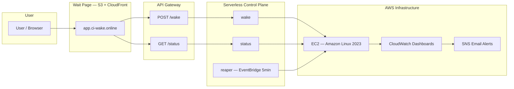

# CI/CD Pipeline for Application Deployment

<p align="center">
  
  
  
  
  
  
  
  
  
</p>

---

##  Live Demo

 **Wait Page:** [https://app.ci-wake.online](https://app.ci-wake.online)  
When you click **“Wake Up”**, the EC2 instance powers on automatically and the site becomes available.  
After **5 minutes of inactivity**, it shuts down to save cost — all managed automatically by Lambda and CloudWatch.

---

##  Project Overview

This project is a **fully automated infrastructure pipeline** for deploying and managing a web application on AWS using:

- **Terraform** — full Infrastructure as Code  
- **GitHub Actions (OIDC)** — CI/CD automation  
- **Serverless control plane** — Lambda functions for wake/sleep logic  
- **Auto-wake page** — hosted on S3 + CloudFront with custom domain  
- **Monitoring and alerts** — via CloudWatch and SNS  

It demonstrates how to build a practical CI/CD environment using Terraform, GitHub Actions, and AWS serverless components.

---

## Features
- Terraform for all infrastructure resources  
- GitHub Actions OIDC workflow (no long-term AWS keys)  
- Lambda-based wake/sleep automation  
- EC2-hosted lightweight application  
- CloudWatch logs, metrics, and SNS alerts  
- Minimal cost when idle  

---

##  Architecture



---

##  Components

###  Infrastructure (Terraform)
- **S3 backend + DynamoDB** — for Terraform state locking  
- **EC2 instance** — Amazon Linux 2023 running a simple demo app  
- **IAM roles** — CloudWatch Agent & Lambda policies  
- **Lambda functions:**
  - `wake`: starts the EC2 instance  
  - `status`: checks EC2 state and public IP  
  - `reaper`: auto-stops instance after idle period  
- **EventBridge rule** — triggers `reaper` every minute  
- **CloudWatch dashboard** — metrics for CPU, status checks, Lambda invocations  
- **SNS alerts** — email when CPU > 70% or EC2 fails health check  

---

##  CI/CD Workflow (GitHub Actions)

- **OIDC authentication** (no access keys)  
- **Terraform plan/apply/destroy** pipeline  
- Triggered manually or on commit in `infra/**`  
- Uses concurrency groups to prevent race conditions  

---

##  Cost Optimization

| Mechanism | Description |
|------------|--------------|
|  **Auto Sleep** | EC2 automatically stops after 5 minutes of inactivity |
|  **Wake on Demand** | EC2 starts only when user clicks “Wake Up” |
|  **S3 + CloudFront** | Wait site is fully static (Always-Free) |
|  **Serverless Control Plane** | Lambdas only run for milliseconds per event |
|  **State backend** | Terraform state stored in low-cost S3/DynamoDB |

---

##  Monitoring

CloudWatch Dashboard includes:

- **EC2 metrics** — CPU Utilization, Status Checks  
- **Lambda Invocations / Errors** — wake, status, reaper  
- **CWAgent** — memory and disk usage  
- **SNS Alerts** — via email  

###  View in AWS Console
Go to **CloudWatch → Dashboards → ruslan-aws-dev-overview**

---

##  Simulate Load (Trigger CloudWatch Alarm)

To trigger the **CPU Utilization > 70%** alert on the EC2 instance, run this inside the EC2 terminal:

```bash
sudo yum install -y stress
stress --cpu 4 --timeout 120
```

Or with Amazon Linux 2023:

```bash
sudo dnf install -y stress-ng
sudo stress-ng --cpu 4 --timeout 120
```

---


## **Project Structure**

```
ci-cd-pipeline-aws/
├── app/                 # Frontend (Wake UI)
├── infra/               # Terraform (core infrastructure)
├── infra/infra-wake/    # Terraform (wake/status APIs, Lambdas, schedule)
├── lambdas/             # Wake / Status / Reaper source code
├── wait-site/           # Public wait page
├── docs/                # Architecture & runbooks
├── cloudwatch/          # CloudWatch agent config for EC2 logs/metrics
├── scripts/             # Deployment & service scripts
├── build/               # Auto-built Lambda ZIP artifacts
├── .github/workflows/   # CI/CD (Terraform deploys)
├── README.md            # Main documentation
└── LICENSE              # MIT license for the project
```

**Full detailed structure:** see [`docs/architecture.md`](./docs/architecture.md)

---

##  Key Highlights
- **Zero manual intervention:** Terraform handles all provisioning.  
- **GitHub → AWS via OIDC:** no secrets in the repo.  
- **Real cost control:** EC2 sleeps automatically after idle.  
- **Visual dashboards:** CloudWatch dashboard for basic EC2 and Lambda metrics.  
- **Portfolio-ready:** clean architecture, full automation, custom domains configured via Route53 and CloudFront.

---

##  Screenshots — System in Action


###  Wait Page — Before Wake-Up  
Shows the static landing page hosted on **S3 + CloudFront**, waiting for user interaction.  


---

###  Application Running — After Wake-Up  
Once the user clicks **“Wake Up”**, the EC2 instance starts and the application becomes accessible.  


---

###  GitHub Actions — infra-wake.yml  
Triggered automatically or manually, this workflow deploys and updates the **serverless control plane**.  


---

###  GitHub Actions — terraform.yml  
Full Terraform CI/CD job applying infrastructure changes via **OIDC authentication** (no stored AWS keys).  


---

###  CloudWatch Dashboard  
Live metrics showing EC2 CPU.  


---

###  SNS Email Alert  
Example of a real **CloudWatch → SNS** notification delivered to email when an alarm triggers.  


---

## License

Released under the MIT License.  
See the LICENSE file for full details.

Branding name “🚀 Ruslan AWS” and related visuals may not be reused or rebranded without permission.
