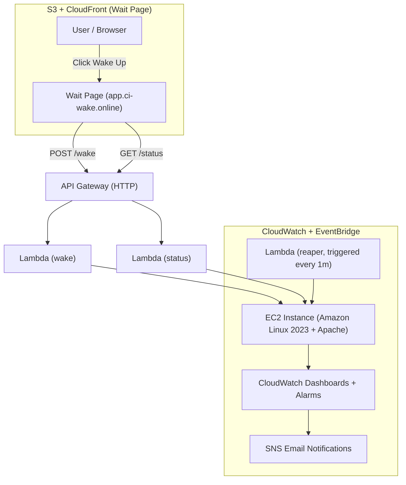

# 🚀 Ruslan AWS — CI/CD Pipeline for Application Deployment


---

## 🌐 Live Demo

🔹 **Wait Page:** [https://app.ci-wake.online](https://app.ci-wake.online)  
When you click **“Wake Up”**, the EC2 instance powers on automatically and the site becomes available.  
After **5 minutes of inactivity**, it shuts down to save cost — all managed automatically by Lambda and CloudWatch.

---

## 🧠 Project Overview

This project represents a **fully automated production-grade DevOps pipeline**, designed to deploy, monitor, and scale a cloud web application using **Terraform**, **AWS**, and **GitHub Actions (OIDC)** — without any manual AWS Console operations.

It demonstrates how to integrate Infrastructure-as-Code, CI/CD automation, event-driven Lambda control, cost management, and full observability into a cohesive, self-healing infrastructure.

---

## ⚙️ Architecture



---

## 🧩 AWS Services Used

| Service | Purpose | Description |
|----------|----------|-------------|
| **EC2 (Elastic Compute Cloud)** | Compute | Runs the demo web app (Apache + static build). Configured via user data and auto-managed lifecycle (wake/sleep). |
| **Lambda** | Serverless compute | 3 functions handle automation:<br>• `wake` — starts EC2 instance.<br>• `status` — returns instance state.<br>• `reaper` — stops instance when idle. |
| **API Gateway (HTTP)** | Entry point | Provides REST endpoints `/wake` and `/status` for front-end to interact with Lambdas. |
| **S3 + CloudFront** | Static hosting + CDN | Hosts the “Wait Page” (`https://app.ci-wake.online`) with global low-latency distribution and HTTPS certificate. |
| **EventBridge** | Automation scheduler | Triggers `reaper` Lambda every minute to check EC2 idle state. |
| **SSM Parameter Store** | State persistence | Stores timestamp of last wake event (`/ci-wake/last_wake`). |
| **CloudWatch** | Monitoring | Dashboards visualize EC2 CPU, memory, Lambda invocations, and alarms for system health. |
| **SNS (Simple Notification Service)** | Alerts | Sends email when alarms are triggered (e.g., CPU > 70% or EC2 health check failure). |
| **IAM (Identity & Access Management)** | Access control | Fine-grained roles for GitHub OIDC, Lambda execution, and CloudWatch agent. |
| **GitHub Actions (OIDC)** | CI/CD pipeline | Authenticates directly with AWS (no long-term keys), runs Terraform apply/destroy automatically on workflow triggers. |
| **Terraform** | Infrastructure as Code | Manages the entire stack lifecycle — from IAM and EC2 to DNS and monitoring. |
| **ACM (AWS Certificate Manager)** | SSL/TLS | Provides HTTPS for both API and static site via validated wildcard certificate. |
| **Route 53** | DNS management | Integrates custom domain `ci-wake.online` and subdomains (`app.` and `api.`). |

---

## 🚀 CI/CD Workflow (GitHub Actions)

The pipeline is split into **two workflows**:

### 🧱 1. `terraform.yml` — Infrastructure Provisioning
- Deploys VPC, EC2, IAM, CloudWatch, and SNS components.  
- Handles backend configuration (S3 + DynamoDB).  
- Runs via GitHub OIDC with temporary AWS credentials.  
- Enforces concurrency groups to prevent parallel conflicts.  

### ⚡ 2. `infra-wake.yml` — Lambda Deployment
- Builds and deploys Lambda ZIPs (`wake`, `status`, `reaper`).  
- Automatically detects EC2 instance by tag (`Name=ruslan-aws-dev`).  
- Updates code only when changes are detected.  

---

## 💰 Cost Optimization

| Mechanism | Description |
|------------|-------------|
| 💤 **Auto Sleep (Lambda + EventBridge)** | The `reaper` Lambda stops the EC2 instance automatically after a defined idle period (default: 5 min). |
| ⚡ **Wake on Demand** | The instance is started only when a user clicks the “Wake Up” button — triggered via API Gateway. |
| ☁️ **Serverless Control Plane** | Lambdas run for only a few milliseconds per request; no idle cost. |
| 💾 **State stored in SSM** | No database overhead — uses free-tier Parameter Store for timestamps. |
| 🧠 **S3 + CloudFront Always-Free Tier** | The wait site costs $0 due to S3’s and CloudFront’s free allowances. |
| 📉 **CloudWatch Custom Metrics** | Optimized to minimal retention; no extra charges for unused metrics. |
| 💸 **Terraform Lifecycle Policies** | Workflows automatically destroy test environments after idle periods to save cost. |

Typical monthly cost: **< $1 under AWS Free Tier** during normal operation.

---

## 📊 Monitoring and Observability

**CloudWatch Dashboards** provide full visibility into system health:  
- **EC2 Metrics:** CPU Utilization, Network In/Out, Status Checks  
- **Lambda Metrics:** Invocations, Duration, Errors, Throttles  
- **CloudWatch Agent:** Memory, Disk usage, uptime  
- **SNS Alerts:** email notifications when alarms trigger  

🖥️ View in AWS Console → **CloudWatch → Dashboards → ruslan-aws-dev-overview**

---

## 🧪 Load Simulation (Trigger Alarm Manually)

Use SSH or SSM Session Manager to connect to EC2 and run:

```bash
sudo yum install -y stress
stress --cpu 4 --timeout 120
```

Or on Amazon Linux 2023:

```bash
sudo dnf install -y stress-ng
sudo stress-ng --cpu 4 --timeout 120
```

This artificially raises CPU utilization, activating the SNS alert and CloudWatch alarm (ALARM state).

---

## 🧭 Domain and Certificates

| Component | Domain | Certificate ARN |
|------------|---------|----------------|
| 🌐 Wait Site | [app.ci-wake.online](https://app.ci-wake.online) | `arn:aws:acm:us-east-1:097635932419:certificate/0d400c46-2086-41b1-b6c2-74112715701a` |
| ⚙️ API Gateway | api.ci-wake.online | Same ACM, validated via Route 53 + Namecheap |

---

## 🧾 Folder Structure

```
ci-cd-pipeline-aws/
├── app/                        # Web app source
│   └── public/
│       ├── index.html
│       └── assets/
│           ├── css/
│           └── js/
├── wait-site/                  # Static "Wake Page" (S3 + CloudFront)
│   ├── index.html
│   └── assets/
│       ├── css/
│       └── js/
├── infra/                      # Terraform Infrastructure
│   ├── main.tf
│   ├── variables.tf
│   ├── providers.tf
│   ├── backend.tf
│   ├── outputs.tf
│   ├── alarms.tf
│   ├── dashboard.tf
│   ├── sns.tf
│   ├── user_data.sh
│   ├── user_data.tpl
│   └── infra-wake/
│       ├── main.tf
│       ├── iam.tf
│       ├── schedule.tf
│       ├── variables.tf
│       ├── outputs.tf
│       ├── backend.tf
│       └── versions.tf
├── lambdas/                    # Serverless functions
│   ├── wake/index.js
│   ├── status/index.py
│   ├── reaper/index.py
│   └── _common/timeparse.py
├── scripts/                    # Bootstrap scripts for EC2
│   ├── deploy_on_instance.sh
│   └── app.service
├── cloudwatch/
│   └── amazon-cloudwatch-agent.json
├── .github/workflows/
│   ├── terraform.yml
│   └── infra-wake.yml
└── README.md
```

---

## 🧠 Key Highlights

- **End-to-End Automation:** Every AWS resource is provisioned via Terraform and deployed through GitHub Actions.  
- **No Secrets:** Secure authentication using OpenID Connect (OIDC).  
- **Event-Driven Cloud:** Lambda and EventBridge manage compute lifecycle automatically.  
- **Cost-Aware Infrastructure:** Pay-only-when-active model.  
- **Observability-First Design:** Built-in CloudWatch dashboards and alarms.  
- **Portfolio-Ready:** Real AWS automation, clean IaC structure, and production-style domains.

---

## 📸 Proof of Work — Live AWS Environment

| Screenshot | Description |
|-------------|-------------|
|  | **Wait Page:** before wake-up — static S3 + CloudFront site |
|  | **Application Online:** EC2 powered up and serving web app |
|  | **GitHub Actions (terraform.yml):** full IaC deployment via OIDC |
|  | **GitHub Actions (infra-wake.yml):** Lambda-based wake workflow |
|  | **CloudWatch Dashboard:** EC2 & Lambda metrics visualized |
|  | **SNS Notification:** automated alert confirming full pipeline cycle |

_All resources deployed and managed end-to-end through Terraform + GitHub Actions (OIDC)._

