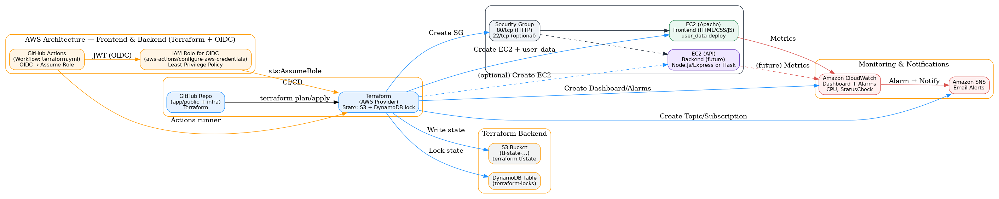

# 🌐 CI/CD Pipeline with Terraform & AWS

This repository demonstrates a **production-like multi-tier AWS setup** managed by Terraform and deployed automatically via GitHub Actions (OIDC).  
It provisions **frontend + backend infrastructure**, monitoring, and notifications.

---

## 📐 Architecture



### Flow
1. **GitHub Actions (OIDC)** assumes an IAM Role → runs `terraform plan/apply/destroy`.
2. **Terraform**:
   - Stores state in **S3** bucket with **DynamoDB** for state locking.
   - Creates **Security Group** (HTTP 80, optional SSH 22).
   - Provisions **Frontend EC2** (Amazon Linux 2023 + Apache).  
     Static site from `infra/app/public` is deployed via `user_data`.
   - (Optional) **Backend EC2** — ready to host an API (Node.js, Flask, etc.).
   - Configures **CloudWatch** (Dashboard + Alarms: CPU, StatusCheck).
   - Creates **SNS** topic with optional email subscription for alerts.

---

## 📂 Repository Layout

```
ci-cd-pipeline-aws/
├── .github/workflows/
│   └── terraform.yml          # CI/CD workflow (apply/destroy, dev/prod)
├── infra/
│   ├── app/public/            # Static website (HTML, CSS, JS)
│   ├── alarms.tf              # CloudWatch alarms
│   ├── backend.tf             # S3 + DynamoDB backend for state
│   ├── dashboard.tf           # CloudWatch dashboard
│   ├── iam.tf                 # IAM roles/policies for EC2 + CloudWatch Agent
│   ├── main.tf                # Core infra: VPC, SG, EC2, user_data
│   ├── outputs.tf             # Useful Terraform outputs
│   ├── providers.tf           # AWS provider + default tags
│   ├── sns.tf                 # SNS topic + subscription
│   ├── user_data.sh           # Cloud-init script (Base64 site deployment)
│   ├── user_data.tpl          # Optional template for app-based deployment
│   ├── variables.tf           # Input variables (region, project, env, etc.)
│   └── versions.tf            # Provider + Terraform version constraints
└── docs/
    └── diagram-frontend-backend.png  # Architecture diagram
```

---

## ⚙️ Environments

- `var.environment` → `dev` | `prod`
- Separate state files + concurrency groups ensure isolation.
- Deploy manually via workflow inputs or automatically on `main` branch push.

---

## 🚀 CI/CD Workflow

- Located at `.github/workflows/terraform.yml`
- Supports:
  - **Apply** (default)
  - **Destroy**
- Inputs:
  - `target_env`: dev | prod
  - `action`: apply | destroy
- Uses **OIDC** to assume AWS IAM role:
  ```yaml
  role-to-assume: arn:aws:iam::<account_id>:role/github-actions-ci-cd-pipeline-aws
  ```

---

## 📊 Monitoring

- **CloudWatch Dashboard**: EC2 CPU Utilization + Status Check
- **CloudWatch Alarms**:  
  - `CPUHigh` (>70% average for 5 min)  
  - `StatusCheckFailedAny`
- **SNS Topic**: `${project_name}-${environment}-alerts`  
  - Optional email subscription: set `var.alert_email`.

---

## 🛠️ Quickstart

### 1. Clone the repo
```bash
git clone git@github.com:rusets/CI-CD-Pipeline-for-Application-Deployment.git
cd CI-CD-Pipeline-for-Application-Deployment
```

### 2. Configure AWS
- OIDC role already configured (`github-actions-ci-cd-pipeline-aws`).
- Terraform state backend:
  - S3: `tf-state-<account>-us-east-1`
  - DynamoDB: `terraform-locks`

### 3. Run locally (optional)
```bash
cd infra
terraform init
terraform plan -var="environment=dev"
terraform apply -var="environment=dev"
```

### 4. Deploy via GitHub Actions
- Go to **Actions → Terraform CI/CD with OIDC → Run workflow**
- Select:
  - Environment: `dev` or `prod`
  - Action: `apply` or `destroy`

---

## 🔐 Security & IAM

- IAM policies follow **least privilege**:
  - EC2: launch, stop, terminate, tagging
  - IAM: only for CloudWatch agent instance profile
  - CloudWatch: dashboards, alarms
  - SNS: topics + subscriptions
  - S3/DynamoDB: Terraform backend state
- No wildcard `iam:*` or `ec2:*` granted.

---

## 📌 Notes

- Frontend deployed from `infra/app/public/`.  
  To update site: edit files → commit → pipeline will redeploy.
- Backend can be added incrementally (API EC2 or ECS/EKS in future).
- Monitoring integrated; email alerts optional.

---

## 👤 Author

**Ruslan Dashkin**  
AWS Certified | DevOps & Cloud Projects  
GitHub: [rusets](https://github.com/rusets)
