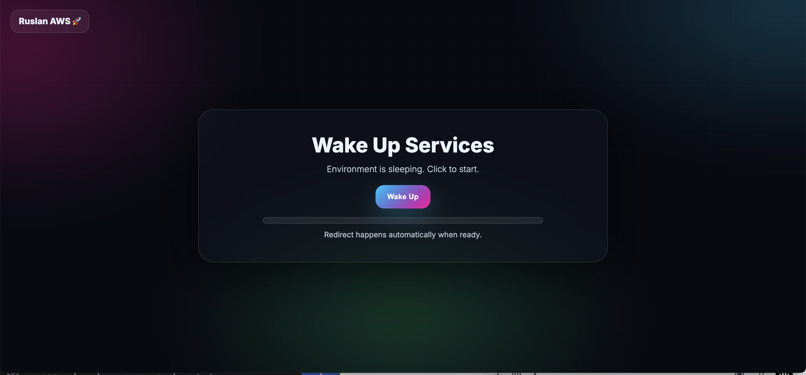
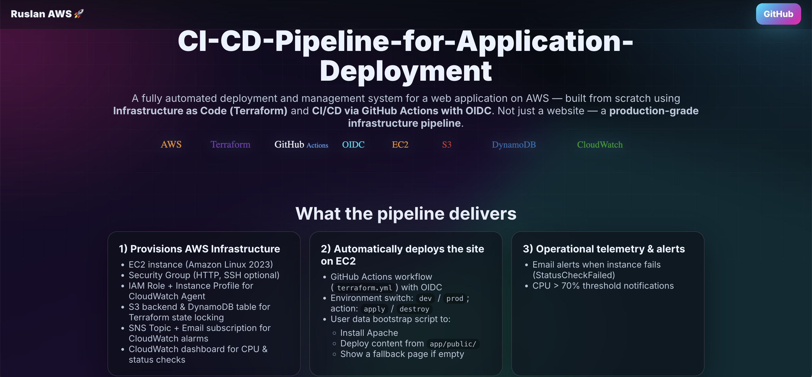
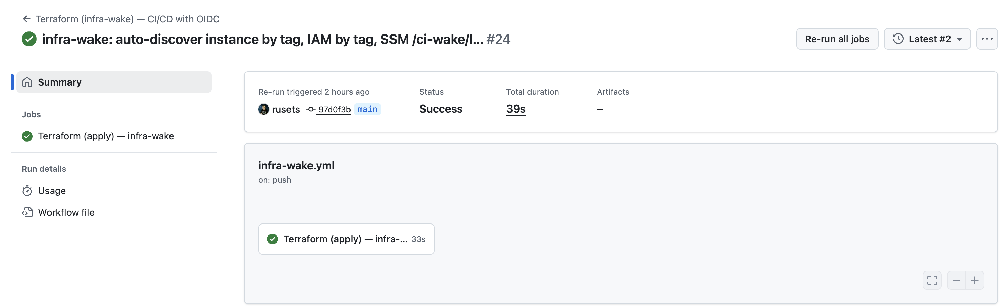
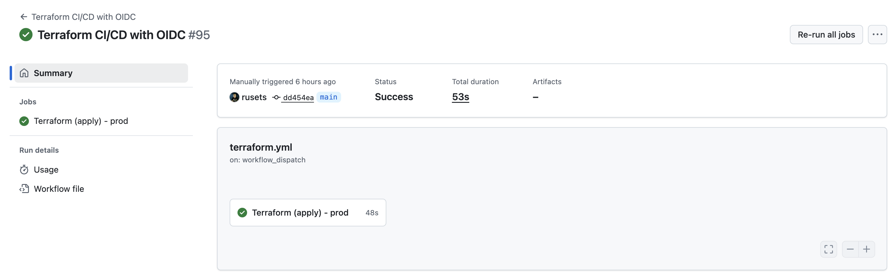
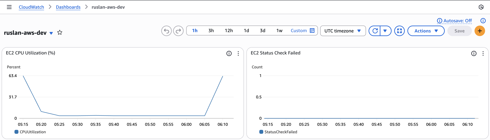
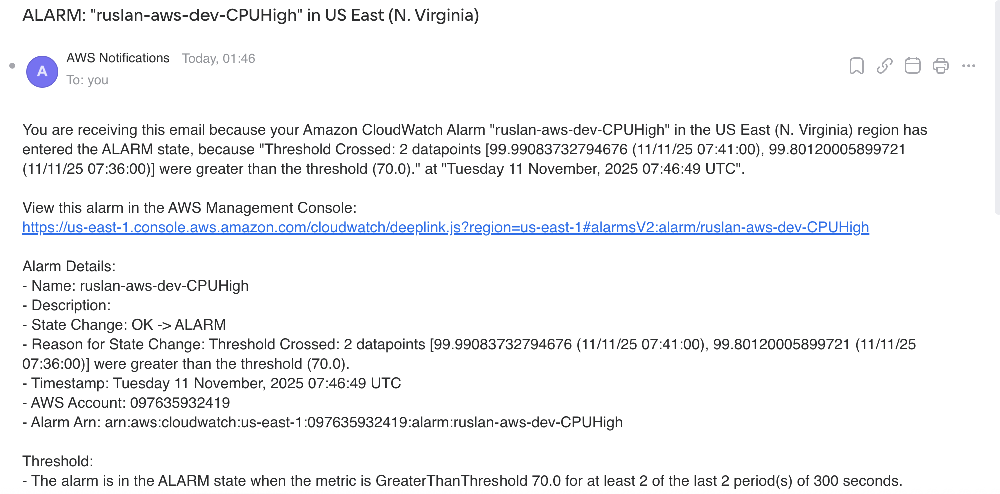

# 🚀 Ruslan AWS — CI/CD Pipeline for Application Deployment


---

## 🌐 Live Demo
**Wait Page:** https://app.ci-wake.online  
Click **“Wake Up”** to start the EC2 instance on-demand. After ~5 minutes of inactivity, it stops automatically to save costs (managed by Lambda + EventBridge + SSM).

---

## 🧠 Project Overview
Production‑grade, cost‑optimized AWS infrastructure delivered via **Terraform** and **GitHub Actions (OIDC)**.  
Highlights:
- **Serverless control plane** (Lambda: `wake`, `status`, `reaper`) to wake/sleep EC2 on demand
- **Static wait site** on **S3 + CloudFront** with custom domain
- **EventBridge** minute rule auto‑stops idle instances
- **CloudWatch Dashboards & Alarms** + **SNS** email notifications
- **Zero long‑lived AWS keys** — GitHub OIDC federated access

---

## ⚙️ Architecture Overview

```mermaid
flowchart TD
  U[User] --> W[Wait Page (S3 + CloudFront)]
  W -->|POST /wake| API[API Gateway (HTTP)]
  W -->|GET /status| API
  API --> LW[Lambda: wake]
  API --> LS[Lambda: status]
  LW --> EC2[(EC2 Instance)]
  LS --> EC2
  EB[EventBridge rule (1m)] --> LR[Lambda: reaper]
  LR --> EC2
  EC2 --> CW[CloudWatch Dashboards & Alarms]
  CW --> SNS[SNS Email]
```
*(No ARNs exposed in the diagram. GitHub renders this Mermaid block correctly.)*

---

## 🧩 AWS Services Used
- **Amazon EC2** — application host (on‑demand start/stop)
- **Amazon S3 + CloudFront** — static wait page (global CDN, low cost)
- **Amazon API Gateway (HTTP)** — `/wake` and `/status` endpoints
- **AWS Lambda** — `wake` (start EC2), `status` (report state), `reaper` (auto‑stop)
- **Amazon EventBridge** — schedule `reaper` every minute
- **AWS Systems Manager (SSM) Parameter Store** — last wake timestamp
- **Amazon CloudWatch** — dashboards, metrics, logs, alarms
- **Amazon SNS** — email notifications
- **AWS IAM** — least‑privilege roles for Lambda, GitHub OIDC
- **GitHub Actions (OIDC)** — Terraform CI/CD without static keys
- **Terraform (S3 backend + DynamoDB lock)** — reproducible infra state

---

## 🚀 CI/CD (GitHub Actions)
- Manual or push‑triggered workflows
- `terraform fmt` + `validate` + `plan` + `apply/destroy`
- Concurrency guards prevent parallel runs on same ref
- Environment variables pass `TF_VAR_*` safely; no secrets committed

---

## 💰 Cost Optimization
| Mechanism | What it does |
|---|---|
| **Wake on Demand** | EC2 stays **stopped** until a user clicks **Wake Up**. |
| **Auto Sleep** | `reaper` stops EC2 after inactivity window (default 5 min). |
| **Serverless Control Plane** | Lambda + API Gateway + EventBridge incur near‑zero idle cost. |
| **Static CDN** | Wait page on S3 + CloudFront uses Always‑Free tier patterns. |
| **Right‑sized IAM** | Scoped Lambda and OIDC permissions; no long‑lived keys. |

---

## 🧪 Simulate Load (to trigger CPU alarm)
On the EC2 instance:
```bash
# Amazon Linux 2023
sudo dnf install -y stress-ng
sudo stress-ng --cpu 4 --timeout 120
```
(For older AMIs you can use `sudo yum install -y stress` and then `stress --cpu 4 --timeout 120`.)

---

## 🗂️ Repository Structure
```
ci-cd-pipeline-aws/
├── app/
│   └── public/
│       ├── index.html
│       └── assets/
│           ├── css/
│           └── js/
├── infra/
│   ├── main.tf
│   ├── variables.tf
│   ├── providers.tf
│   ├── backend.tf
│   ├── outputs.tf
│   ├── alarms.tf
│   ├── dashboard.tf
│   ├── sns.tf
│   ├── user_data.sh
│   ├── user_data.tpl
│   └── infra-wake/
│       ├── main.tf
│       ├── iam.tf
│       ├── schedule.tf
│       ├── variables.tf
│       ├── outputs.tf
│       ├── backend.tf
│       └── versions.tf
├── lambdas/
│   ├── wake/    └── index.js
│   ├── status/  └── index.py
│   ├── reaper/  └── index.py
│   └── _common/ └── timeparse.py
├── wait-site/
│   ├── index.html
│   └── assets/
│       ├── css/
│       └── js/
├── scripts/
│   ├── deploy_on_instance.sh
│   └── app.service
├── cloudwatch/
│   └── amazon-cloudwatch-agent.json
├── docs/
│   └── screenshots/
│       ├── 1-wait-page.png
│       ├── 2-app-running.png
│       ├── 3-github-actions-wake.png
│       ├── 4-github-actions-terraform.png
│       ├── 5-cloudwatch-dashboard.png
│       └── 6-sns-alert-email.png
└── .github/workflows/
    ├── terraform.yml
    └── infra-wake.yml
```

---

## 🖼️ Screenshots (quick view)
> Images must exist in `docs/screenshots/`.
- 
- 
- 
- 
- 
- 

---

## 🔑 Notes
- Keep ARNs out of the diagram and README unless absolutely necessary.
- If screenshots don’t load on GitHub, confirm the **relative path** and that the images are committed.
- Mermaid block above is **GitHub‑compatible** (`flowchart TD` + `-->` edges, no stray `end`).

---

## 📣 Key Takeaways (for recruiters)
- Real AWS infra with on‑demand economics (wake/sleep)
- Clean, auditable CI/CD via Terraform + OIDC
- Production patterns: API Gateway, Lambda, EventBridge, CloudWatch, SNS, IAM
- Clear dashboards + alarms to observe system behavior
