```mermaid
flowchart LR
  subgraph User
    U[User / Browser]
  end

  subgraph Frontend["Wait Page — S3 + CloudFront"]
    W[app.ci-wake.online]
  end

  subgraph API["API Gateway"]
    API1[POST /wake]
    API2[GET /status]
  end

  subgraph Lambda["Serverless Control Plane"]
    Lwake[wake]
    Lstatus[status]
    Lreaper[reaper — EventBridge 5min]
  end

  subgraph Infra["AWS Infrastructure"]
    EC2[EC2 — Amazon Linux 2023]
    CW[CloudWatch Dashboards]
    SNS[SNS Email Alerts]
  end

  U --> W
  W --> API1
  W --> API2
  API1 --> Lwake
  API2 --> Lstatus
  Lwake --> EC2
  Lstatus --> EC2
  Lreaper --> EC2
  EC2 --> CW
  CW --> SNS
```

# 🚀 Ruslan AWS — CI/CD Pipeline for Application Deployment


---

## 🧠 Project Overview

This project is a **fully automated infrastructure pipeline** for deploying and managing a web application on AWS using:

- **Terraform** — full Infrastructure as Code  
- **GitHub Actions (OIDC)** — CI/CD automation  
- **Serverless control plane** — Lambda functions for wake/sleep logic  
- **Auto-wake page** — hosted on S3 + CloudFront with custom domain  
- **Monitoring and alerts** — via CloudWatch and SNS  

It demonstrates how to build a **production-grade CI/CD environment** that stays cost-efficient while showcasing real AWS automation.

---


## 🌐 Live Demo

🔹 **Wait Page:** [https://app.ci-wake.online](https://app.ci-wake.online)  
When you click **“Wake Up”**, the EC2 instance powers on automatically and the site becomes available.  
After **5 minutes of inactivity**, it shuts down to save cost — all managed automatically by Lambda and CloudWatch.

---

## ⚙️ Architecture



---

## 🧩 Components

### 🌩️ Infrastructure (Terraform)
- **S3 backend + DynamoDB** — for Terraform state locking  
- **EC2 instance** — Amazon Linux 2023 with Apache + auto-deploy site.zip  
- **IAM roles** — CloudWatch Agent & Lambda policies  
- **Lambda functions:**
  - `wake`: starts the EC2 instance  
  - `status`: checks EC2 state and public IP  
  - `reaper`: auto-stops instance after idle period  
- **EventBridge rule** — triggers `reaper` every minute  
- **CloudWatch dashboard** — metrics for CPU, status checks, Lambda invocations  
- **SNS alerts** — email when CPU > 70% or EC2 fails health check  

---

## 🚀 CI/CD Workflow (GitHub Actions)

- **OIDC authentication** (no access keys)  
- **Terraform plan/apply/destroy** pipeline  
- Triggered manually or on commit in `infra/**`  
- Uses concurrency groups to prevent race conditions  

---

## 💰 Cost Optimization

| Mechanism | Description |
|------------|--------------|
| 💤 **Auto Sleep** | EC2 automatically stops after 5 minutes of inactivity |
| ⚡ **Wake on Demand** | EC2 starts only when user clicks “Wake Up” |
| ☁️ **S3 + CloudFront** | Wait site is fully static (Always-Free) |
| 🧠 **Serverless Control Plane** | Lambdas only run for milliseconds per event |
| 💾 **State backend** | Terraform state stored in low-cost S3/DynamoDB |

---

## 📊 Monitoring

CloudWatch Dashboard includes:

- **EC2 metrics** — CPU Utilization, Status Checks  
- **Lambda Invocations / Errors** — wake, status, reaper  
- **CWAgent** — memory and disk usage  
- **SNS Alerts** — via email  

### 🖥️ View in AWS Console
Go to **CloudWatch → Dashboards → ruslan-aws-dev-overview**

---

## 🧪 Simulate Load (Trigger CloudWatch Alarm)

To trigger the **CPU Utilization > 70%** alert on the EC2 instance, run this inside the EC2 terminal:

```bash
sudo yum install -y stress
stress --cpu 4 --timeout 120
```

Or with Amazon Linux 2023:

```bash
sudo dnf install -y stress-ng
sudo stress-ng --cpu 4 --timeout 120
```

---


## 🧾 Folder Structure

```
ci-cd-pipeline-aws/
├── app/
│   └── public/
│       ├── index.html
│       └── assets/
│           ├── css/
│           └── js/
├── infra/
│   ├── main.tf
│   ├── variables.tf
│   ├── providers.tf
│   ├── backend.tf
│   ├── outputs.tf
│   ├── alarms.tf
│   ├── dashboard.tf
│   ├── sns.tf
│   ├── user_data.sh
│   ├── user_data.tpl
│   └── infra-wake/
│       ├── main.tf
│       ├── iam.tf
│       ├── schedule.tf
│       ├── variables.tf
│       ├── outputs.tf
│       ├── backend.tf
│       └── versions.tf
├── lambdas/
│   ├── wake/    └── index.js
│   ├── status/  └── index.py
│   ├── reaper/  └── index.py
│   └── _common/ └── timeparse.py
├── wait-site/
│   ├── index.html
│   └── assets/
│       ├── css/
│       └── js/
├── scripts/
│   ├── deploy_on_instance.sh
│   └── app.service
├── cloudwatch/
│   └── amazon-cloudwatch-agent.json
├── .github/workflows/
│   ├── terraform.yml
│   └── infra-wake.yml
└── README.md
```

---

## 🧠 Key Highlights
- **Zero manual intervention:** Terraform handles all provisioning.  
- **GitHub → AWS via OIDC:** no secrets in the repo.  
- **Real cost control:** EC2 sleeps automatically after idle.  
- **Visual dashboards:** live metrics and timeline of wake/sleep events.  
- **Portfolio-ready:** clean architecture, full automation, real custom domains.

---

## 🖼️ Screenshots — System in Action


### 1️⃣ Wait Page — Before Wake-Up  
Shows the static landing page hosted on **S3 + CloudFront**, waiting for user interaction.  


---

### 2️⃣ Application Running — After Wake-Up  
Once the user clicks **“Wake Up”**, the EC2 instance starts and the application becomes accessible.  


---

### 3️⃣ GitHub Actions — infra-wake.yml  
Triggered automatically or manually, this workflow deploys and updates the **serverless control plane**.  


---

### 4️⃣ GitHub Actions — terraform.yml  
Full Terraform CI/CD job applying infrastructure changes via **OIDC authentication** (no stored AWS keys).  


---

### 5️⃣ CloudWatch Dashboard  
Live metrics showing EC2 CPU.  


---

### 6️⃣ SNS Email Alert  
Example of a real **CloudWatch → SNS** notification delivered to email when an alarm triggers.  
